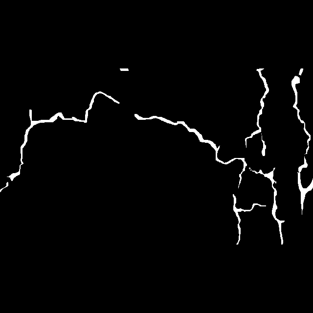

# 단일 출력 채널을 이용한 크랙 세그멘테이션 방법

참조코드 : 

[https://github.com/4uiiurz1/pytorch-nested-unet](https://github.com/4uiiurz1/pytorch-nested-unet)

# UNet 모델을 활용한 단일출력 세그멘테이션 수행

### **Data**

- **CRACKTREE 200 CRKWH100 CRACKLS315**

### Data Processing

- **albumentations Normalize**
    - mean = 0.535
    - std = 0.135
- **albumentations RandomRotation90**
- **albumentations Flip**
- **sklearn MinMaxScaler()**
- **cv2 CLAHE**

### 모델 구성

- **UNet 모델**
    - **입력 채널 = 3**
    - **출력 채널 = 1**
- **바깥 레이어의 출력은 로그잇(logit) 값입니다.**
- **이 로그잇 값은 시그모이드(sigmoid) 함수를 통해 크랙일 확률값인 0에서 1 사이의 값으로 변환됩니다.**
- **변환된 확률값을 사용하여 세그멘테이션을 수행합니다.**
- **단일출력모델에서는 변환된 확률값에서 Crack  판별하는 임계점값이 중요합니다**

### UNet Architecture Summary

| Layer (type) | Output Shape | Param # |
| --- | --- | --- |
| UNet | [1, 1, 512, 512] | -- |
| ├─ VGGBlock: 1-1 | [1, 32, 512, 512] | -- |
| │ ├─ Conv2d: 2-1 | [1, 32, 512, 512] | 896 |
| │ ├─ BatchNorm2d: 2-2 | [1, 32, 512, 512] | 64 |
| │ ├─ ReLU: 2-3 | [1, 32, 512, 512] | -- |
| │ ├─ Conv2d: 2-4 | [1, 32, 512, 512] | 9,248 |
| │ ├─ BatchNorm2d: 2-5 | [1, 32, 512, 512] | 64 |
| │ ├─ ReLU: 2-6 | [1, 32, 512, 512] | -- |
| ├─ MaxPool2d: 1-2 | [1, 32, 256, 256] | -- |
| ├─ VGGBlock: 1-3 | [1, 64, 256, 256] | -- |
| │ ├─ Conv2d: 2-7 | [1, 64, 256, 256] | 18,496 |
| │ ├─ BatchNorm2d: 2-8 | [1, 64, 256, 256] | 128 |
| │ ├─ ReLU: 2-9 | [1, 64, 256, 256] | -- |
| │ ├─ Conv2d: 2-10 | [1, 64, 256, 256] | 36,928 |
| │ ├─ BatchNorm2d: 2-11 | [1, 64, 256, 256] | 128 |
| │ ├─ ReLU: 2-12 | [1, 64, 256, 256] | -- |
| ├─ MaxPool2d: 1-4 | [1, 64, 128, 128] | -- |
| ├─ VGGBlock: 1-5 | [1, 128, 128, 128] | -- |
| │ ├─ Conv2d: 2-13 | [1, 128, 128, 128] | 73,856 |
| │ ├─ BatchNorm2d: 2-14 | [1, 128, 128, 128] | 256 |
| │ ├─ ReLU: 2-15 | [1, 128, 128, 128] | -- |
| │ ├─ Conv2d: 2-16 | [1, 128, 128, 128] | 147,584 |
| │ ├─ BatchNorm2d: 2-17 | [1, 128, 128, 128] | 256 |
| │ ├─ ReLU: 2-18 | [1, 128, 128, 128] | -- |
| ├─ MaxPool2d: 1-6 | [1, 128, 64, 64] | -- |
| ├─ VGGBlock: 1-7 | [1, 256, 64, 64] | -- |
| │ ├─ Conv2d: 2-19 | [1, 256, 64, 64] | 295,168 |
| │ ├─ BatchNorm2d: 2-20 | [1, 256, 64, 64] | 512 |
| │ ├─ ReLU: 2-21 | [1, 256, 64, 64] | -- |
| │ ├─ Conv2d: 2-22 | [1, 256, 64, 64] | 590,080 |
| │ ├─ BatchNorm2d: 2-23 | [1, 256, 64, 64] | 512 |
| │ ├─ ReLU: 2-24 | [1, 256, 64, 64] | -- |
| ├─ MaxPool2d: 1-8 | [1, 256, 32, 32] | -- |
| ├─ VGGBlock: 1-9 | [1, 512, 32, 32] | -- |
| │ ├─ Conv2d: 2-25 | [1, 512, 32, 32] | 1,180,160 |
| │ ├─ BatchNorm2d: 2-26 | [1, 512, 32, 32] | 1,024 |
| │ ├─ ReLU: 2-27 | [1, 512, 32, 32] | -- |
| │ ├─ Conv2d: 2-28 | [1, 512, 32, 32] | 2,359,808 |
| │ ├─ BatchNorm2d: 2-29 | [1, 512, 32, 32] | 1,024 |
| │ ├─ ReLU: 2-30 | [1, 512, 32, 32] | -- |
| ├─ Upsample: 1-10 | [1, 512, 64, 64] | -- |
| ├─ VGGBlock: 1-11 | [1, 256, 64, 64] | -- |
| │ ├─ Conv2d: 2-31 | [1, 256, 64, 64] | 1,769,728 |
| │ ├─ BatchNorm2d: 2-32 | [1, 256, 64, 64] | 512 |
| │ ├─ ReLU: 2-33 | [1, 256, 64, 64] | -- |
| │ ├─ Conv2d: 2-34 | [1, 256, 64, 64] | 590,080 |
| │ ├─ BatchNorm2d: 2-35 | [1, 256, 64, 64] | 512 |
| │ ├─ ReLU: 2-36 | [1, 256, 64, 64] | -- |
| ├─ Upsample: 1-12 | [1, 256, 128, 128] | -- |
| ├─ VGGBlock: 1-13 | [1, 128, 128, 128] | -- |
| │ ├─ Conv2d: 2-37 | [1, 128, 128, 128] | 442,496 |
| │ ├─ BatchNorm2d: 2-38 | [1, 128, 128, 128] | 256 |
| │ ├─ ReLU: 2-39 | [1, 128, 128, 128] | -- |
| │ ├─ Conv2d: 2-40 | [1, 128, 128, 128] | 147,584 |
| │ ├─ BatchNorm2d: 2-41 | [1, 128, 128, 128] | 256 |
| │ ├─ ReLU: 2-42 | [1, 128, 128, 128] | -- |
| ├─ Upsample: 1-14 | [1, 128, 256, 256] | -- |
| ├─ VGGBlock: 1-15 | [1, 64, 256, 256] | -- |
| │ ├─ Conv2d: 2-43 | [1, 64, 256, 256] | 110,656 |
| │ ├─ BatchNorm2d: 2-44 | [1, 64, 256, 256] | 128 |
| │ ├─ ReLU: 2-45 | [1, 64, 256, 256] | -- |
| │ ├─ Conv2d: 2-46 | [1, 64, 256, 256] | 36,928 |
| │ ├─ BatchNorm2d: 2-47 | [1, 64, 256, 256] | 128 |
| │ ├─ ReLU: 2-48 | [1, 64, 256, 256] | -- |
| ├─ Upsample: 1-16 | [1, 64, 512, 512] | -- |
| ├─ VGGBlock: 1-17 | [1, 32, 512, 512] | -- |
| │ ├─ Conv2d: 2-49 | [1, 32, 512, 512] | 27,680 |
| │ ├─ BatchNorm2d: 2-50 | [1, 32, 512, 512] | 64 |
| │ ├─ ReLU: 2-51 | [1, 32, 512, 512] | -- |
| │ ├─ Conv2d: 2-52 | [1, 32, 512, 512] | 9,248 |
| │ ├─ BatchNorm2d: 2-53 | [1, 32, 512, 512] | 64 |
| │ ├─ ReLU: 2-54 | [1, 32, 512, 512] | -- |
| ├─ Conv2d: 1-18 | [1, 1, 512, 512] | 33 |
| Total params |  | 7,852,545 |
| Trainable params |  | 7,852,545 |
| Non-trainable params |  | 0 |
| Total mult-adds (G) |  | 55.87 |
| Input size (MB) |  | 3.15 |
| Forward/backward pass size (MB) |  | 1025.51 |
| Params size (MB) |  | 31.41 |
| Estimated Total Size (MB) |  | 1060.06 |


**마지막 분류 layer의 출력 shape 1 1 512 512      [batch_size , chaneel , height , width ] 입니다**               

### 평가 방법

- **Precision**
- **Recall**
- **F1 Score**
- **Optimal Image Scale (OIS)**
- **Optimal Dataset Scale (ODS)**

각 데이터셋의 구조는 이하 디렉토리 구조와 같습니다

```
**inputs
└── DATASET
    ├── CRACKTREE260
    │   ├── images
    │   │   ├── 00ae65... (JPEG 파일)
    │   └── masks
    │       ├── 00ae65... (BMP 파일)
    │
    ├── CRKWH100
    │   ├── images
    │   │   ├── 00ae65... (png 파일)
    │   └── masks
    │       ├── 00ae65... (BMP 파일)
    │
    ├── CRACKLS315
    │   ├── images
    │   │   ├── 00ae65... (JPEG 파일)
    │   └── masks
    │       ├── 00ae65... (BMP 파일** 
    
```

## **데이터전처리**

`sklearn.model_selection.train_test_split`을 이용하여 전체 데이터셋의 10%를 validation 검증 데이터셋으로 사용합니다.

`torch.utils.data.Dataset`을 이용하여 이미지와 마스크에 대해 동일한 데이터 증강을 적용하고, 이미지 값의 범위를 0~255 → 0~1 범위로 재조정합니다.


albumentations 라이브러리의 `RandomRotate90` 및 `Flip` 함수를 이용하여 데이터 증강을 수행하였습니다.

일부 데이터셋은 `mean=0.5`, `std=0.135`를 이용하여 추가적인 이미지 정규화 과정을 수행하였습니다.


추가시도: CrackTree260 데이터셋은 800 x 600 및 960 x 720 이미지들로 구성되어 있습니다. CRKWH100과 CRACKLS315 데이터셋은 512 x 512 이미지로 구성되어 있어, 세 가지 데이터셋에 동일한 모델을 적용하려면 동일한 이미지 크기로 재구성할 필요가 있습니다. 따라서 CrackTree260 데이터셋의 이미지를 512 x 512 크기로 변경하기 위해 **A.Resize(512, 512)**를 사용하여 이미지 크기를 줄였습니다. 그러나 손실율(BCEDiceLoss)이 0.35 ~ 0.4에서 개선되지 않는 모습을 확인하였습니다. 이에 따라, 이미지의 전체 크기를 줄이는 대신 일부만 **A.RandomCrop(512)** 512 x 512 크기로 잘라내어 훈련을 진행하니 손실율이 0.25 ~ 0.3까지 개선되는 부분을 확인할 수 있었습니다. 이를 통해 Crack 탐지와 같은 중요한 이미지의 경우, 비율적으로 이미지를 줄이는 것보다 원본 이미지의 픽셀을 그대로 보존하면서 일부분을 잘라내는 것이 학습에 더 효과적입니다

참고사항: CRACK500 데이터셋을 이용하여 학습을 할때 Unet 모델 input으로 640 x 640 으로 이미지를 입력으로 넣기위해 340 x 640 이미지를 패딩을 추가하여 640 x 640 이미지로 구성하여 학습하였더니 좋은성능을 얻었습니다

[바이너리 출력을 이용한 크랙 세그멘테이션 방법](https://www.notion.so/3395d3198b744928ac72985be0ab8054?pvs=21) 




```python
class Dataset_min_max(torch.utils.data.Dataset):

    def __init__(self, img_ids, img_dir, mask_dir, img_ext, mask_ext, num_classes, transform=None):
        self.img_ids = img_ids
        self.img_dir = img_dir
        self.mask_dir = mask_dir
        self.img_ext = img_ext
        self.mask_ext = mask_ext
        self.num_classes = num_classes
        self.transform = Compose([
            A.RandomRotate90(),
            A.Flip(),
            A.RandomCrop(height=512,width=512)
        ])
        
        self.scaled = MinMaxScaler()
        
    def __len__(self):
        return len(self.img_ids)

    def __getitem__(self, idx):
        img_id = self.img_ids[idx]
        
        img = cv2.imread(os.path.join(self.img_dir, img_id +'.' + self.img_ext),cv2.IMREAD_COLOR)
        mask = cv2.imread(os.path.join(self.mask_dir , img_id +'.'+self.mask_ext),cv2.IMREAD_GRAYSCALE)
        
        if img is None or mask is None:
            raise FileExistsError()
        
        
        if self.transform is not None:
            augmented = self.transform(image=img, mask=mask)
            img = augmented['image']
            mask = augmented['mask']
            img = self.__min_max_convert(img)

            
        img = img.transpose(2, 0, 1)
        mask = mask.astype('float32') / 255
        mask = np.expand_dims(mask , axis=0)
        
        if np.all( img == 0 ): 
            raise Exception(f"image All Elemnets is None")
        
        assert img.shape[1:] == mask.shape[1:], f"not same image shape: img shape {img.shape}, mask shape {mask.shape}"
        
        img = torch.Tensor(img)
        mask = torch.Tensor(mask)
        return img, mask 
    
    def __min_max_convert(self,image:np.array):
        h,w,c = image.shape
        
        image_reshaped = image.reshape(-1,1)
        min_max_scaler = self.scaled
        image_scaled = min_max_scaler.fit_transform(image_reshaped)
        image_scaled = image_scaled.reshape(h,w,c)
        
```

## Model Training

- **Loss Function**:  BCEDiceLoss → BCEWithLogitLoss + Dice 을 사용합니다

$$
𝐷𝑖𝑐𝑒=2∗∣𝐴∩𝐵∣/∣𝐴∣+∣𝐵∣=2∗𝑇𝑃(𝑇𝑃+𝐹𝑃)+(𝑇𝑃+𝐹𝑁)                
$$

추가시도 : Focal Loss, Binary Cross-Entropy, Dice Loss 세 가지 손실 함수를 이용하여 동일한 모델과 동일한 Optimizer에서 훈련을 진행해보았습니다.

- **Focal Loss**: 분류 문제에서 사용되는 손실 함수로, 클래스 불균형 문제에서 좋은 성능을 보여줍니다. 어렵게 분류되는 샘플에 더 많은 가중치를 부여하고, 쉽게 분류되는 샘플에는 가중치를 줄이는 방식으로 수행됩니다.
    
    → Crack 데이터셋은 레이블 값이 0 (Non-crack)과 1 (Crack)로 구성되며, 대부분의 이미지는 Non-Crack (0)인 부분으로 구성됩니다. 이를 통해 클래스 불균형 문제가 있다고 판단하여 Focal Loss를 사용하여 학습을 시도하였으나, 초기부터 낮은 손실율을 보여주었고, 손실율이 낮지만 평가 지표와 시각화를 진행했을 때 학습을 하지 못한 모습을 보였습니다.
    
- **Binary Cross-Entropy**: 모델의 예측 확률과 실제 레이블 사이의 차이를 측정합니다. 모델이 예측한 확률이 실제 레이블과 얼마나 가까운지를 평가하여, 모델이 예측을 개선할 수 있도록 합니다.
    
    → BCE 손실 함수는 이진 분류에 특화되어 있으며, 로그 손실 함수를 사용하여 예측값과 실제값이 크게 다를 때 손실 함수가 크게 증가하여 모델의 학습이 올바르게 진행되도록 합니다. BCE를 사용하여 학습한 경우, Focal Loss보다는 좋은 성능을 보여주었으나, 손실율이 0.4에서 감소하지 않았습니다.
    

```python
 class BCEDiceLoss(nn.Module):
    def __init__(self):
        super().__init__()

    def forward(self, input, target):
        bce = F.binary_cross_entropy_with_logits(input, target)
        smooth = 1e-5
        input = torch.sigmoid(input)
        num = target.size(0)
        input = input.view(num, -1)
        target = target.view(num, -1)
        intersection = (input * target)
        dice = (2. * intersection.sum(1) + smooth) / (input.sum(1) + target.sum(1) + smooth)
        dice = 1 - dice.sum() / num
        return 0.5 * bce + dice
```

- **Optimizer**: Adam 옵티마이저를 사용하였으며, 기본 Learning rate는 1e-2, weight_decay는 1e-4로 설정하여 특정 가중치의 업데이트 범위를 제한하였습니다.
- **L2 규제화**를 사용합니다. 손실값에 가중치들의 제곱을 추가하여, 가중치가 큰 폭으로 업데이트될 때 규제를 통해 과적합을 방지합니다.

```python
  optimizer = optim.Adam(params , lr = 1e-2 , weight_decay=1e-4] )

```

$$
L(W)=1/N∑(yi−W^tXi)^2+λ∑Wj^2
$$

- **Learning Rate Scheduler**:학습 스케줄러는 일정 횟수 동안 손실을 기반으로 하여 10번 동안 손실률 개선이 없을 때 기존 Learning rate에서 factor만큼 새로운 Learning rate를 계산합니다
- (`torch.optim.lr_scheduler.ReduceLROnPlateau`)
    - `mode="min"`
    - `patience=10`
    - `min_lr=1e-8`
    - `factor=0.1`

- **Metrics**: 정밀도(Precision), 재현율(Recall), F1 스코어를 통해 성능 지표를 측정합니다.

```python
    for epoch in range(config['epochs']):
        print('Epoch [%d/%d]' % (epoch, config['epochs']))

        # train for one epoch
        train_log = train(config, train_loader, model, criterion, optimizer)
        writer.add_scalar('loss/train',train_log['loss'] , epoch)
        
        writer.add_scalar('iou/train' , train_log['iou'] , epoch)
        
        # evaluate on validation set
        val_log = validate(config, val_loader, model, criterion)
        writer.add_scalar('loss/val',val_log['loss'] , epoch)
        writer.add_scalar('iou/val', val_log['iou'] , epoch)
        
        if config['scheduler'] == 'CosineAnnealingLR':
            scheduler.step()
        elif config['scheduler'] == 'ReduceLROnPlateau':
            scheduler.step(val_log['loss'])
 
        print('loss %.4f - iou %.4f - val_loss %.4f - val_iou %.4f Learing Rate %e'
              % (train_log['loss'], train_log['iou'], val_log['loss'], val_log['iou'] , scheduler.get_last_lr()[0]))

        log['epoch'].append(epoch)
        
    def train(config, train_loader, model, criterion, optimizer):
		    logging.info(("\n" + "%12s" * 3) % ("Epoch", "GPU Mem", "Loss"))
		        
		    avg_meters = {'loss': AverageMeter(),
		                  'iou': AverageMeter()}
		
		    model.train()
		
		    pbar = tqdm(total=len(train_loader))
		    for i , (input, target) in enumerate(train_loader):
		        input = input.cuda()
		        target = target.cuda()
		
		        # compute output
		        if config['deep_supervision']:
		            outputs = model(input)
		            loss = 0
		            for output in outputs:
		                loss += criterion(output, target)
		            loss /= len(outputs)
		            iou = iou_score(outputs[-1], target)
		        else:
		            output = model(input)
		            loss = criterion(output, target)
		            iou = iou_score(output, target)
		
		        # compute gradient and do optimizing step
		        optimizer.zero_grad()
		        loss.backward()
		        optimizer.step()
```

# **U net 모델구조 설명**

```python
class VGGBlock(nn.Module):
    def __init__(self, in_channels, middle_channels, out_channels):
        super().__init__()
        self.relu = nn.ReLU(inplace=True)
        self.conv1 = nn.Conv2d(in_channels, middle_channels, 3, padding=1)
        self.bn1 = nn.BatchNorm2d(middle_channels)
        self.conv2 = nn.Conv2d(middle_channels, out_channels, 3, padding=1)
        self.bn2 = nn.BatchNorm2d(out_channels)

    def forward(self, x):
        out = self.conv1(x)
        out = self.bn1(out)
        out = self.relu(out)

        out = self.conv2(out)
        out = self.bn2(out)
        out = self.relu(out)

        return out
```

VGGBlock에서는 Double(Conv2d)가 수행됩니다. 하나의 Convolution 연산이 수행될 때마다 batchNorm 과정과 ReLU 활성화 함수가 이루어집니다.

```python
class UNet(nn.Module):
    def __init__(self, num_classes, input_channels=3, **kwargs):
        super().__init__()

        nb_filter = [32, 64, 128, 256, 512]

        self.pool = nn.MaxPool2d(2, 2)
        self.up = nn.Upsample(scale_factor=2, mode='bilinear', align_corners=True)

        self.conv0_0 = VGGBlock(input_channels, nb_filter[0], nb_filter[0])
        self.conv1_0 = VGGBlock(nb_filter[0], nb_filter[1], nb_filter[1])
        self.conv2_0 = VGGBlock(nb_filter[1], nb_filter[2], nb_filter[2])
        self.conv3_0 = VGGBlock(nb_filter[2], nb_filter[3], nb_filter[3])
        self.conv4_0 = VGGBlock(nb_filter[3], nb_filter[4], nb_filter[4])

        self.conv3_1 = VGGBlock(nb_filter[3]+nb_filter[4], nb_filter[3], nb_filter[3])
        self.conv2_2 = VGGBlock(nb_filter[2]+nb_filter[3], nb_filter[2], nb_filter[2])
        self.conv1_3 = VGGBlock(nb_filter[1]+nb_filter[2], nb_filter[1], nb_filter[1])
        self.conv0_4 = VGGBlock(nb_filter[0]+nb_filter[1], nb_filter[0], nb_filter[0])

        self.final = nn.Conv2d(nb_filter[0], num_classes, kernel_size=1)

    def forward(self, input):
        x0_0 = self.conv0_0(input)
        x1_0 = self.conv1_0(self.pool(x0_0))
        x2_0 = self.conv2_0(self.pool(x1_0))
        x3_0 = self.conv3_0(self.pool(x2_0))
        x4_0 = self.conv4_0(self.pool(x3_0))

        x3_1 = self.conv3_1(torch.cat([x3_0, self.up(x4_0)], 1))
        x2_2 = self.conv2_2(torch.cat([x2_0, self.up(x3_1)], 1))
        x1_3 = self.conv1_3(torch.cat([x1_0, self.up(x2_2)], 1))
        x0_4 = self.conv0_4(torch.cat([x0_0, self.up(x1_3)], 1))

        output = self.final(x0_4)
        return output
```

UNet 기본 클래스는 4번의 수축 과정과 4번의 확장 과정으로 이루어집니다. 확장 과정에서는 수축 과정에서의 결과를 합치며, 이전 과정의 결과를 업샘플(upsample) 과정을 통해 수행합니다.

추가시도 : Deep_Supervison

깊은 신경망 학습과정중에서 사용되는 기법중 하나입니다 깊은신경망의 중간층에서도 손실함수를 적용하여 학습과정정에서 정확도향상에 기여합니다

→ Deep_Supervison을 이용할시 Unet모델이 아닌 Unet++ 모델로써 다른 모델입니다


# **추론 및 평가**

```python
class Eval_MODE():
    def __init__(self):
        self.epsilon = 1e-7
    
    def __call__(self,model,data_loader,device):
        l = self.main(model , data_loader , device)
        return l
    @torch.inference_mode
    def main(self , model , data_loader , device):
        """input ---> model test_data_loader device <<<<"""
        model.eval()
        loss_list = []
        out_list = []
        target_list = []
        criterion = BCEDiceLoss()
        for image , target  in tqdm(data_loader , total=len(data_loader)):
            image , target = image.to(device) , target.to(device)
            with torch.no_grad():
                out = model(image)
                loss = criterion(out , target)
                loss_list.append(loss)
                out_list.append(out)
                target_list.append(target)

        it_range = np.arange(0.1 , 1.01 , 0.01)
        best_th = 0.0
        best_f = 0.0
        best_p = 0.0
        best_r = 0.0
        OIS_RES = self.get_OIS(out_list , target_list)
        for th in it_range:
            th_res , p , r , f= self.get_ODS(out_list, target_list ,th)   
            if f > best_f:
                best_f = f 
                best_th = th_res
                best_p = p
                best_r = r
        print(f"----------> 정밀도평균 : {best_p:.5f} 재현율평균 : {best_r:.5f} OIS : {OIS_RES:.5f}  ODS(F1 score 평균) : {best_f:.5f}")
        return  sum(loss_list) / len(loss_list)

    def get_f1_score(self, outputs , target , th):
        outputs = torch.sigmoid(outputs)
        outputs = (outputs > th).float()
        
        TP = (outputs * target).sum().item()
        FP = (outputs * (1-target)).sum().item()
        FN = ((1-outputs) * target).sum().item()
        
        precision = TP / (TP + FP + self.epsilon)
        recall = TP / (TP + FN + self.epsilon)
        f1_score = 2 * (precision * recall) / (precision + recall + self.epsilon)
        
        return f1_score

    def find_best_threshold(self , outputs , target):
        thresholds = np.arange(0, 1.01, 0.01)
        best_f1 = 0.0
        best_thresholds = 0.0
        for i in thresholds:
            f1 = self.get_f1_score(outputs , target , i)
            #print(f"f1 : {f1} threshold : {i}")
            if f1 > best_f1:
                best_f1 = f1
                best_thresholds = i
        return best_thresholds , best_f1
    
    
    def get_OIS(self , out_list : list , target_list : list) :
        f1_list = []
        res = zip(out_list , target_list)
        for i  , (out , target) in enumerate(res):
            output = torch.sigmoid(out)
            best_th , f_ = self.find_best_threshold(output , target)
            print(f"{i}-->Threshold : {best_th:.2f} f1_score : {f_:.4f}")
            f1_list.append(f_)
            
        OIS_RESULT =  sum(f1_list) / len(f1_list)    
        return OIS_RESULT
        
        
    def get_ODS(self , out_list , target_list , th=0.5 , flag=False):
        
        precision_list = []
        recall_list = []
        f1_score_list = []
        res = zip(out_list , target_list)
        for output,target in res:
            output = torch.sigmoid(output)
            
            output = (output > th).float()
            
            TP = (output * target).sum().item()
            FP = (output * (1-target)).sum().item()
            FN = ((1-output) * target).sum().item()
            
            precision = TP / (TP + FP + 1e-7)
            recall = TP / (TP + FN + 1e-7)
            f1_score = 2 * (precision * recall) / (precision + recall + 1e-7)
            
            precision_list.append(precision)
            recall_list.append(recall)
            f1_score_list.append(f1_score)

        p = sum(precision_list) / len(precision_list)
        r = sum(recall_list) / len(recall_list)
        f = sum(f1_score_list) / len(f1_score_list)
        return th , p , r , f

```

- **Precision** : 모델이 양성 클래스로 예측한 데이터 중 실제로 양성인 데이터의 비율을 보여줍니다

$$
Precision=TP/TP + FP
$$

- **Recall** : 실제 양성 데이터 중 모델이 양성으로 올바르게 예측한 데이터의 비율을 보여줍니다.

$$
Recall=TP/TP+FN
$$

- **f1-Score** :  Precision과 Recall의 조화평균을 사용하여 계산합니다.

$$
F1=2⋅Precision+Recall/Precision⋅Recall
$$

- **OIS** : 각 이미지에서 최고의 F1 점수를 받는 경계점을 통한 모든 이미지의 F1 점수 평균값입니다.

- **ODS** : 모든 이미지에서 동일한 경계점을 기준으로 한 F1 점수 평균값입니다.

# 결과 / 정리

CrackTree260 Tensorboard 


초기 손실율은 1에서 시작하여 0.35까지 감소하는 현상을 볼수있으나 이후 개선이되지않는 학습정체를 볼수있습니다 

추가시도 : Attention Unet 모델 손실율이 0.17까지 감소하였습니다


> 3가지의 데이터셋을 가지고 훈련을 진행하였으며, CrackTree260 데이터셋은 추가적인 전처리 과정을 통해 성능 향상을 관측하였습니다. CrackTree260과 CRKWH100 데이터셋은 서로 다른 데이터셋의 성능을 추가적으로 검증하였습니다.
> 
> 
> ---
> 

## CRACKTREE260


CRACKTREE → CRKWH100


CRACKTREE - > CRACKLS315


## CRACKTree260 Norm 수행 Mean 0.5 std 0.135


CRACKTREE → CRKWH 100


CRACKTREE → CRACKLS315


## 평활화 CLAHE(Contrast Limited Adaptive Histogram Equalization) 수행

히스토그램 평활화를 통해 명암대비를 개선하였습니다. CLAHE는 이미지의 명암대비를 국부적으로 개선하여 세부 사항을 더 잘 보이게 하는 방법입니다. 이를 통해 전체적으로 이미지의 디테일을 향상시키며, 특히 조명 조건이 균일하지 않은 이미지에서 유용하게 사용됩니다.


CRACK TREE


CRKWH 100


CRACKLS315


## **CRKWH100**


CRKWH100 → CRACKTREE


CRKWH100 → CRACKLS315


## **CRACKLS315**


